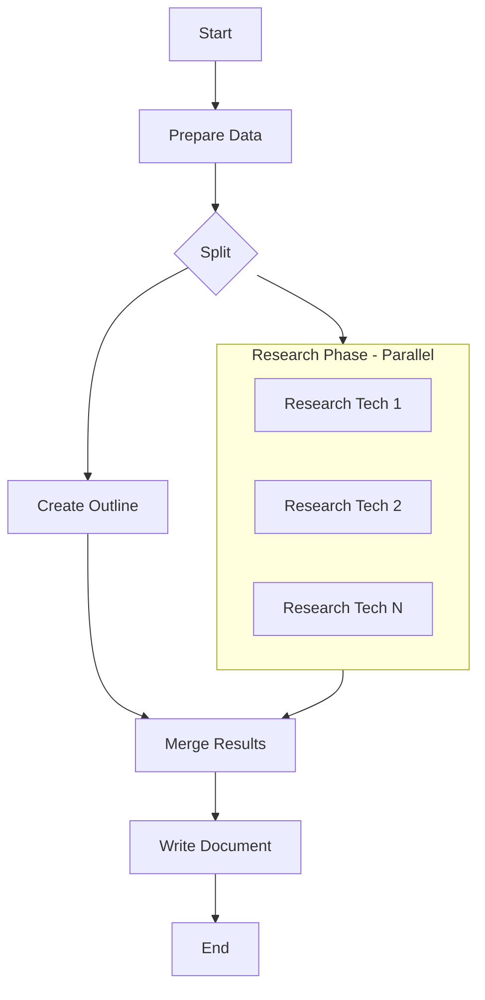

# PocketFlow - Technology Document Generator

A PocketFlow application that generates comprehensive technology documentation with parallel web research.

## Features

- **Input**: List of technologies (e.g., FastAPI, Vue.js, Redis)
- **Parallel Execution**: Outline generation and research happen simultaneously for improved performance
- **Outline Generation**: Creates structured document outline with LLM
- **Web Research**: Async web research for each technology using DuckDuckGo
- **Document Writing**: Comprehensive document generation based on outline and research

## Quick Start

### 1. Install Dependencies

```bash
pip install -r requirements.txt
```

Required packages:
- `pocketflow` - Core framework
- `openai` - OpenAI API integration
- `requests` - HTTP requests for web search
- `beautifulsoup4` - HTML parsing for search results
- `pyyaml` - YAML processing for structured output
- `python-dotenv` - Environment variable management

### 2. Set OpenAI API Key

Create a `.env` file in the project root:

```bash
# .env file
OPENAI_API_KEY="your-openai-api-key-here"
```

Or set as environment variable:
```bash
export OPENAI_API_KEY="your-openai-api-key-here"
```

### 3. Run the Application

```bash
# Default mode with parallel execution
python main.py

# Interactive mode - choose your own technologies
python main.py --interactive
```

## How It Works

The application follows the **PocketFlow Agentic Coding** principles with a parallel execution pattern:

### Parallel Execution Flow



**Performance Benefits**: 
- Outline generation and technology research run simultaneously
- Better resource utilization and faster execution
- Scalable to handle multiple technologies efficiently

### Nodes

1. **PrepareDataNode**: Initializes data and coordinates parallel execution
2. **CreateOutlineNode**: Generates structured outline using OpenAI (runs in parallel)
3. **ResearchTechnologiesNode**: Parallel web research using DuckDuckGo (runs in parallel)
4. **MergeResultsNode**: Waits for both outline and research completion, then merges results
5. **WriteDocumentNode**: Creates final document combining outline + research

### Design Patterns Used

- **Split-Merge Pattern**: Parallel execution with coordination
- **Map Reduce**: Parallel research phase with aggregation
- **Async**: Non-blocking research execution

## File Structure

```
PocketFlow/
├── main.py                  # Main application entry point (parallel mode)
├── nodes.py                 # Node definitions (5 nodes total)
├── parallel_flow.py         # Parallel flow implementation  
├── utils/
│   ├── call_llm.py          # OpenAI LLM wrapper
│   └── search_web.py        # DuckDuckGo search wrapper
├── docs/
│   └── design.md            # Technical design document
└── requirements.txt         # Dependencies
```

## Configuration

### Technologies List

Edit the `technologies` list in `main.py`:

```python
technologies = [
    "FastAPI",
    "Vue.js", 
    "Redis"
]
```

### Retry Settings

Nodes have built-in retry mechanisms:

- **CreateOutlineNode**: 2 retries, 1s wait
- **ResearchTechnologiesNode**: 2 retries, 2s wait  
- **WriteDocumentNode**: 3 retries, 1s wait

## Output

The application generates:

1. **Console output**: Progress updates and document preview
2. **Markdown file**: Complete technology document saved locally
3. **Structured data**: Outline and research results in shared store

## Example Output

```markdown
# Technology Overview: FastAPI, Vue.js, Redis

## Introduction
...

## FastAPI
### Overview
FastAPI is a modern, fast (high-performance) web framework...

### Latest Version and Updates
FastAPI 0.104 was released in October 2023...
```

## Troubleshooting

### Common Issues

1. **Missing OpenAI API Key**
   ```bash
   export OPENAI_API_KEY="your-key-here"
   ```

2. **Import Errors**
   ```bash
   pip install -r requirements.txt
   ```

3. **Search Rate Limiting**
   - The search utility includes delays between requests
   - Reduce `max_results` if encountering issues

## Links

- **Docs**: https://the-pocket.github.io/PocketFlow/
- **GitHub**: https://github.com/the-pocket/PocketFlow
