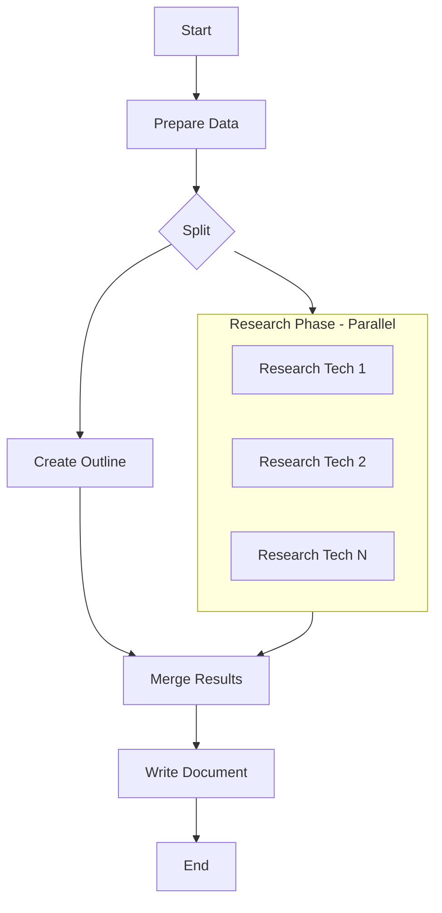

# PocketFlow - Technology Document Generator

A PocketFlow application that generates comprehensive technology documentation with parallel web research using an encapsulated workflow class.

## Features

- **Encapsulated Workflow**: Clean class-based interface with the `TechnologyDocumentGenerator` class
- **Input**: List of technologies (e.g., FastAPI, Vue.js, Redis)
- **Parallel Execution**: Outline generation and research happen simultaneously for improved performance
- **Outline Generation**: Creates structured document outline with LLM
- **Web Research**: Async web research for each technology using DuckDuckGo
- **Document Writing**: Comprehensive document generation based on outline and research
- **Error Handling**: Comprehensive validation and error handling with custom exception types
- **Configuration**: Flexible configuration for retries, timeouts, and logging

## Quick Start

### 1. Install Dependencies

```bash
pip install -r requirements.txt
```

Required packages:
- `pocketflow` - Core framework
- `openai` - OpenAI API integration
- `requests` - HTTP requests for web search
- `beautifulsoup4` - HTML parsing for search results
- `pyyaml` - YAML processing for structured output
- `python-dotenv` - Environment variable management

### 2. Set OpenAI API Key

Create a `.env` file in the project root:

```bash
# .env file
OPENAI_API_KEY="your-openai-api-key-here"
```

Or set as environment variable:
```bash
export OPENAI_API_KEY="your-openai-api-key-here"
```

### 3. Run the Application

```bash
# Default mode with encapsulated workflow
python main.py

# Interactive mode - choose your own technologies
python main.py --interactive

# Run examples showing class usage
python example_usage.py
```

### 4. Using the Class Directly

```python
from utils.tech_doc_generator import TechnologyDocumentGenerator

# Basic usage
generator = TechnologyDocumentGenerator()
document = generator.invoke(["FastAPI", "Vue.js", "Redis"])

# Save the document
with open("tech_doc.md", "w") as f:
    f.write(document)
```

## TechnologyDocumentGenerator Class API

### Basic Usage

```python
from utils.tech_doc_generator import TechnologyDocumentGenerator, GeneratorConfig

# Create generator with default settings
generator = TechnologyDocumentGenerator()

# Generate document
document = generator.invoke(["Technology1", "Technology2"])
```

### Advanced Configuration

```python
from utils.tech_doc_generator import GeneratorConfig

# Custom configuration
config = GeneratorConfig(
    max_retries={
        'prepare': 1,
        'outline': 3,
        'research': 2,
        'merge': 1,
        'write': 4
    },
    wait_times={
        'prepare': 1,
        'outline': 2,
        'research': 3,
        'merge': 1,
        'write': 2
    },
    timeout_seconds=180,
    log_level="DEBUG"
)

generator = TechnologyDocumentGenerator(config)
document = generator.invoke(technologies)
```

### Error Handling

```python
from utils.tech_doc_generator import (
    TechnologyDocumentGenerator,
    TechDocGeneratorError,
    InputValidationError,
    FlowExecutionError,
    OutputValidationError
)

generator = TechnologyDocumentGenerator()

try:
    document = generator.invoke(["FastAPI", "Vue.js"])
    print("✅ Success!")
except InputValidationError as e:
    print(f"❌ Invalid input: {e}")
except FlowExecutionError as e:
    print(f"❌ Execution failed: {e}")
except OutputValidationError as e:
    print(f"❌ Output validation failed: {e}")
except TechDocGeneratorError as e:
    print(f"❌ General error: {e}")
```

### Configuration Options

| Parameter | Type | Default | Description |
|-----------|------|---------|-------------|
| `max_retries` | Dict[str, int] | See below | Maximum retries per node type |
| `wait_times` | Dict[str, int] | See below | Wait time between retries (seconds) |
| `timeout_seconds` | int | 120 | Total timeout for workflow |
| `enable_logging` | bool | True | Enable/disable logging |
| `log_level` | str | "INFO" | Logging level |

**Default Retry Configuration:**
```python
max_retries = {
    'prepare': 1,
    'outline': 2,
    'research': 2,
    'merge': 1,
    'write': 3
}

wait_times = {
    'prepare': 1,
    'outline': 1,
    'research': 2,
    'merge': 1,
    'write': 1
}
```

## How It Works

The application follows the **PocketFlow Agentic Coding** principles with a parallel execution pattern:

### Parallel Execution Flow



**Performance Benefits**: 
- Outline generation and technology research run simultaneously
- Better resource utilization and faster execution
- Scalable to handle multiple technologies efficiently

### Nodes

1. **PrepareDataNode**: Initializes data and coordinates parallel execution
2. **CreateOutlineNode**: Generates structured outline using OpenAI (runs in parallel)
3. **ResearchTechnologiesNode**: Parallel web research using DuckDuckGo (runs in parallel)
4. **MergeResultsNode**: Waits for both outline and research completion, then merges results
5. **WriteDocumentNode**: Creates final document combining outline + research

### Design Patterns Used

- **Split-Merge Pattern**: Parallel execution with coordination
- **Map Reduce**: Parallel research phase with aggregation
- **Async**: Non-blocking research execution

## File Structure

```
PocketFlow/
├── main.py                  # Main application entry point (uses encapsulated class)
├── example_usage.py         # Examples showing class usage patterns
├── nodes.py                 # Node definitions (5 nodes total)
├── parallel_flow.py         # Legacy parallel flow implementation (deprecated)
├── utils/
│   ├── __init__.py
│   ├── call_llm.py          # OpenAI LLM wrapper
│   ├── search_web.py        # DuckDuckGo search wrapper
│   └── tech_doc_generator.py # NEW: Encapsulated workflow class
├── docs/
│   └── design.md            # Technical design document
└── requirements.txt         # Dependencies
```

### Key Files

- **`utils/tech_doc_generator.py`**: The main encapsulated workflow class
- **`main.py`**: Simplified application entry point using the class
- **`example_usage.py`**: Comprehensive examples of class usage
- **`nodes.py`**: Individual node implementations (used internally by the class)
### Key Files

- **`utils/tech_doc_generator.py`**: The main encapsulated workflow class
- **`main.py`**: Simplified application entry point using the class
- **`example_usage.py`**: Comprehensive examples of class usage
- **`nodes.py`**: Individual node implementations (used internally by the class)

## Configuration

### Technologies List

You can modify technologies in several ways:

1. **Edit `main.py`** for default technologies:
```python
technologies = [
    "FastAPI",
    "Vue.js", 
    "Redis"
]
```

2. **Use interactive mode**:
```bash
python main.py --interactive
```

3. **Use the class directly**:
```python
generator = TechnologyDocumentGenerator()
document = generator.invoke(["Your", "Technologies", "Here"])
```

### Class Configuration

The `TechnologyDocumentGenerator` class accepts a `GeneratorConfig` object:

```python
from utils.tech_doc_generator import GeneratorConfig

config = GeneratorConfig(
    max_retries={'outline': 3, 'research': 2, 'write': 4},
    wait_times={'outline': 2, 'research': 3, 'write': 1},
    timeout_seconds=180,
    log_level="DEBUG"
)
```

## Output

The application generates:

1. **Console output**: Progress updates and document preview
2. **Markdown file**: Complete technology document saved locally
3. **Structured data**: Outline and research results in shared store

## Example Output

```markdown
# Technology Overview: FastAPI, Vue.js, Redis

## Introduction
...

## FastAPI
### Overview
FastAPI is a modern, fast (high-performance) web framework...

### Latest Version and Updates
FastAPI 0.104 was released in October 2023...
```

## Troubleshooting

### Common Issues

1. **Missing OpenAI API Key**
   ```bash
   export OPENAI_API_KEY="your-key-here"
   ```

2. **Import Errors**
   ```bash
   pip install -r requirements.txt
   ```

3. **Search Rate Limiting**
   - The search utility includes delays between requests
   - Reduce `max_results` if encountering issues

## Links

- **Docs**: https://the-pocket.github.io/PocketFlow/
- **GitHub**: https://github.com/the-pocket/PocketFlow
