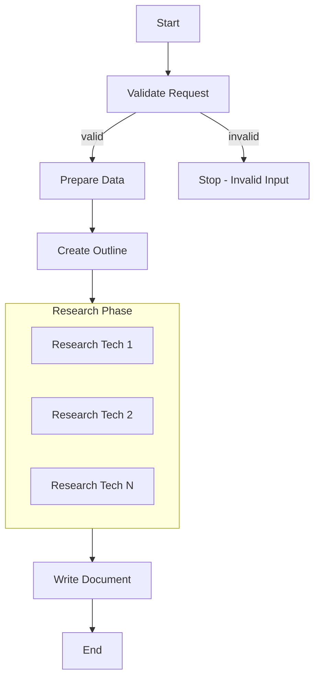

# PocketFlow - Technology Document Generator

A PocketFlow application that generates comprehensive technology documentation using an A2A (Agent-to-Agent) framework with encapsulated workflow class.

## Features

- **A2A Agent Framework**: Built on Agent-to-Agent communication protocol
- **Encapsulated Workflow**: Clean class-based interface with the `TechnologyDocumentGenerator` class
- **Input**: Natural language requests or comma-separated technologies (e.g., "FastAPI, Vue.js, Redis")
- **Serial Processing**: Structured workflow with validation → preparation → outline → research → writing
- **Outline Generation**: Creates structured document outline with LLM
- **Web Research**: Async web research for each technology using DuckDuckGo
- **Document Writing**: Comprehensive document generation based on outline and research
- **Error Handling**: Comprehensive validation and error handling with custom exception types
- **Configuration**: Flexible configuration for retries, timeouts, and logging

## Quick Start

### 1. Install Dependencies

```bash
pip install -r requirements.txt
```

Required packages:
- `pocketflow` - Core framework
- `openai` - OpenAI API integration
- `requests` - HTTP requests for web search
- `beautifulsoup4` - HTML parsing for search results
- `pyyaml` - YAML processing for structured output
- `python-dotenv` - Environment variable management
- `a2a` - Agent-to-Agent communication framework
- `uvicorn` - ASGI server for A2A agent
- `httpx` - HTTP client for A2A communication

### 2. Set OpenAI API Key

Create a `.env` file in the project root:

```bash
# .env file
OPENAI_API_KEY="your-openai-api-key-here"
```

Or set as environment variable:
```bash
export OPENAI_API_KEY="your-openai-api-key-here"
```

### 3. Run the Application

#### Option A: As A2A Agent Server (Recommended)
```bash
# Start the A2A agent server
python -m tech_doc_generator.a2a.server

# In another terminal, send requests to the agent
python -m tech_doc_generator.a2a.client
```

#### Option B: Direct Class Usage
```bash
# Run with the module entry point
python -m tech_doc_generator
```

### 4. Using the Class Directly

```python
from src.tech_doc_generator.utils.tech_doc_generator import TechnologyDocumentGenerator

# Basic usage with natural language
generator = TechnologyDocumentGenerator()
document = await generator.invoke("I want documentation for FastAPI, Vue.js, and Redis")

# Usage with technology list string
document = await generator.invoke("FastAPI,Vue.js,Redis")

# Save the document
with open("tech_doc.md", "w") as f:
    f.write(document)
```

## TechnologyDocumentGenerator Class API

### Basic Usage

```python
from src.tech_doc_generator.utils.tech_doc_generator import TechnologyDocumentGenerator

# Create generator with default settings
generator = TechnologyDocumentGenerator()

# Generate document from natural language request
document = await generator.invoke("Create documentation for FastAPI and Redis")

# Generate document from technology list
document = await generator.invoke("FastAPI,Redis,Docker")
```

### Advanced Configuration

```python
from src.tech_doc_generator.utils.tech_doc_generator import GeneratorConfig

# Custom configuration
config = GeneratorConfig(
    max_retries={
        'validate': 2,
        'prepare': 1,
        'outline': 3,
        'research': 2,
        'write': 4
    },
    wait_times={
        'validate': 1,
        'prepare': 1,
        'outline': 2,
        'research': 3,
        'write': 2
    },
    timeout_seconds=180,
    log_level="DEBUG"
)

generator = TechnologyDocumentGenerator(config)
document = await generator.invoke("FastAPI,Vue.js,Redis")
```

### Error Handling

```python
from src.tech_doc_generator.utils.tech_doc_generator import (
    TechnologyDocumentGenerator,
    TechDocGeneratorError,
    InputValidationError,
    FlowExecutionError,
    OutputValidationError
)

generator = TechnologyDocumentGenerator()

try:
    document = await generator.invoke("FastAPI,Vue.js")
    print("✅ Success!")
except InputValidationError as e:
    print(f"❌ Invalid input: {e}")
except FlowExecutionError as e:
    print(f"❌ Execution failed: {e}")
except OutputValidationError as e:
    print(f"❌ Output validation failed: {e}")
except TechDocGeneratorError as e:
    print(f"❌ General error: {e}")
```

### Configuration Options

| Parameter | Type | Default | Description |
|-----------|------|---------|-------------|
| `max_retries` | Dict[str, int] | See below | Maximum retries per node type |
| `wait_times` | Dict[str, int] | See below | Wait time between retries (seconds) |
| `timeout_seconds` | int | 120 | Total timeout for workflow |
| `enable_logging` | bool | True | Enable/disable logging |
| `log_level` | str | "INFO" | Logging level |

**Default Retry Configuration:**
```python
max_retries = {
    'validate': 2,
    'prepare': 1,
    'outline': 2,
    'research': 2,
    'write': 3
}

wait_times = {
    'validate': 1,
    'prepare': 1,
    'outline': 1,
    'research': 2,
    'write': 1
}
```

## How It Works

The application follows the **PocketFlow Agentic Coding** principles with a serial execution pattern:

### Serial Execution Flow



**Key Features**: 
- Input validation ensures proper request format
- Structured serial flow with clear error handling
- Parallel research within the research node for efficiency
- Natural language input processing for flexible user interaction

### Nodes

1. **ValidateRequestNode**: Parses and validates input requests (natural language or technology lists)
2. **PrepareDataNode**: Initializes data structures and prepares for processing
3. **CreateOutlineNode**: Generates structured outline using OpenAI
4. **ResearchTechnologiesNode**: Parallel web research using DuckDuckGo (AsyncParallelBatchNode)
5. **WriteDocumentNode**: Creates final document combining outline + research

### Design Patterns Used

- **Serial Workflow Pattern**: Sequential execution with validation gates
- **Batch Processing**: Parallel research within individual nodes
- **Async Processing**: Non-blocking operations for web research
- **A2A Agent Pattern**: Agent-to-Agent communication protocol

## File Structure

```
PocketFlow/
├── src/
│   └── tech_doc_generator/
│       ├── __main__.py          # Module entry point
│       ├── agent_executor.py    # A2A agent executor implementation
│       ├── nodes.py             # Node definitions (5 nodes total)
│       ├── flow.py              # Serial flow implementation  
│       ├── constants.py         # Application constants
│       ├── exceptions.py        # Custom exception types
│       ├── validators.py        # Input/output validation logic
│       ├── a2a/
│       │   ├── __init__.py
│       │   ├── client.py        # A2A client implementation
│       │   └── server.py        # A2A server implementation
│       └── utils/
│           ├── __init__.py
│           ├── call_llm.py      # OpenAI LLM wrapper
│           ├── search_web.py    # DuckDuckGo search wrapper
│           └── tech_doc_generator.py # Encapsulated workflow class
├── docs/
│   └── design.md                # Technical design document
├── scripts/
│   └── build-and-run.sh         # Build and deployment scripts
├── requirements.txt             # Dependencies
├── Dockerfile                   # Container configuration
└── IMPLEMENTATION_SUMMARY.md   # Implementation details
```

### Key Files

- **`src/tech_doc_generator/utils/tech_doc_generator.py`**: The main encapsulated workflow class
- **`src/tech_doc_generator/__main__.py`**: Module entry point for direct execution
- **`src/tech_doc_generator/agent_executor.py`**: A2A agent executor for server mode
- **`src/tech_doc_generator/nodes.py`**: Individual node implementations (used internally by the class)
- **`src/tech_doc_generator/flow.py`**: Serial flow definition and orchestration
- **`src/tech_doc_generator/a2a/`**: Agent-to-Agent communication components

## Configuration

### Input Formats

The application accepts flexible input formats:

1. **Natural Language**: "Create documentation for FastAPI and Redis"
2. **Comma-separated list**: "FastAPI,Vue.js,Redis"  
3. **Technology list with descriptions**: "FastAPI web framework, Vue.js frontend, Redis database"

### Running as A2A Agent

1. **Start the server**:
```bash
python -m tech_doc_generator.a2a.server
```

2. **Send requests via client**:
```bash
python -m tech_doc_generator.a2a.client
```

3. **Use the class directly**:
```python
from src.tech_doc_generator.utils.tech_doc_generator import TechnologyDocumentGenerator

generator = TechnologyDocumentGenerator()
document = await generator.invoke("Your request here")
```

### Class Configuration

The `TechnologyDocumentGenerator` class accepts a `GeneratorConfig` object:

```python
from src.tech_doc_generator.utils.tech_doc_generator import GeneratorConfig

config = GeneratorConfig(
    max_retries={'validate': 2, 'outline': 3, 'research': 2, 'write': 4},
    wait_times={'validate': 1, 'outline': 2, 'research': 3, 'write': 1},
    timeout_seconds=180,
    log_level="DEBUG"
)
```

## Output

The application generates:

1. **Console output**: Progress updates and document preview
2. **Markdown file**: Complete technology document saved locally
3. **Structured data**: Outline and research results in shared store

## Example Output

```markdown
# Technology Overview: FastAPI, Vue.js, Redis

## Introduction
...

## FastAPI
### Overview
FastAPI is a modern, fast (high-performance) web framework...

### Latest Version and Updates
FastAPI 0.104 was released in October 2023...
```

## Troubleshooting

### Common Issues

1. **Missing OpenAI API Key**
   ```bash
   export OPENAI_API_KEY="your-key-here"
   ```

2. **Import Errors**
   ```bash
   pip install -r requirements.txt
   ```

3. **Search Rate Limiting**
   - The search utility includes delays between requests
   - Reduce `max_results` if encountering issues

## Links

- **Docs**: https://the-pocket.github.io/PocketFlow/
- **GitHub**: https://github.com/the-pocket/PocketFlow
