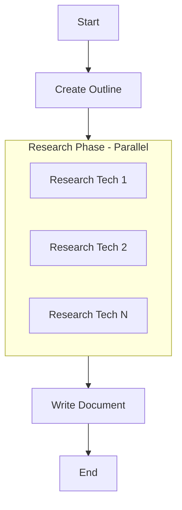

# Technology Document Generator - Design Document

## 1. Requirements
Create an AI system that generates comprehensive technology documentation by:
- Taking a list of technologies as input (e.g., Python, React, SQL)
- Creating an outline for a document with sections for each technology
- Researching each technology on the web for recent versions and information
- Writing a comprehensive document based on the outline and research

**Target Users**: Developers, technical writers, and teams needing up-to-date technology overviews.

## 2. Flow Design

The system follows a **Workflow** pattern with **Map Reduce** for parallel research:



**Flow Steps:**
1. **CreateOutline**: Generate structured outline with sections for each technology
2. **ResearchTechnologies**: Parallel web research for each technology (async)
3. **WriteDocument**: Generate comprehensive document using outline + research

**Design Pattern**: Workflow + Map Reduce (for parallel research)

## 3. Utilities

External utility functions needed:

- **`call_llm`** (`utils/call_llm.py`)
  - input: `str` (prompt)
  - output: `str` (LLM response)
  - necessity: Used by outline and writing nodes for LLM calls

- **`search_web`** (`utils/search_web.py`)
  - input: `str` (search query)
  - output: `str` (search results)
  - necessity: Used by research node to gather current information

## 4. Data Design

Shared store structure:
```python
shared = {
    "technologies": ["Python", "React", "SQL"],  # Input list
    "outline": {                                  # Generated outline
        "title": "Technology Overview",
        "sections": [
            {"tech": "Python", "subsections": ["Overview", "Latest Version", "Key Features"]},
            {"tech": "React", "subsections": ["Overview", "Latest Version", "Key Features"]},
            # ...
        ]
    },
    "research_results": {                         # Research findings
        "Python": "Python 3.12 released with...",
        "React": "React 18.2 features...",
        # ...
    },
    "final_document": "# Technology Overview\n..."  # Final output
}
```

## 5. Node Design

### CreateOutlineNode (Regular Node)
- **type**: Regular
- **prep**: Read "technologies" list from shared store
- **exec**: Call LLM to generate structured outline for document
- **post**: Write "outline" to shared store

### ResearchTechnologiesNode (AsyncParallelBatchNode)
- **type**: AsyncParallelBatchNode
- **prep**: Read "technologies" list from shared store
- **exec**: Search web for each technology (parallel execution)
- **post**: Write "research_results" dict to shared store

### WriteDocumentNode (Regular Node)
- **type**: Regular
- **prep**: Read "outline" and "research_results" from shared store
- **exec**: Call LLM to write comprehensive document
- **post**: Write "final_document" to shared store

## 6. Implementation Notes

- Use OpenAI API for LLM calls
- Use DuckDuckGo search for web research
- Parallel research execution for efficiency
- Error handling through Node retry mechanisms
- Structured output using YAML formatting for outline
